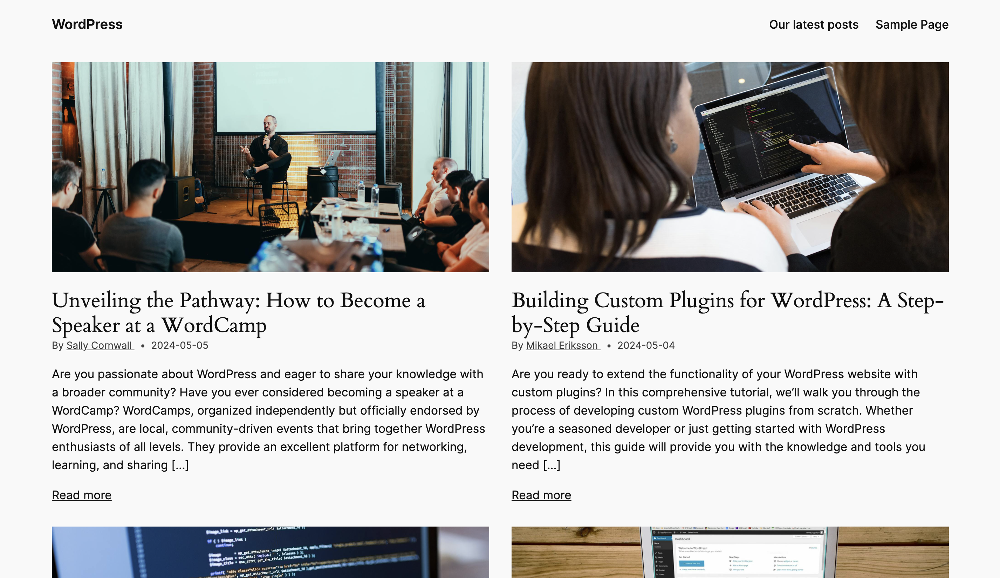

# Post Grid Block

This block was scaffolded with the Create Block tool.

## Description

This block displays a grid of posts on your website. It is highly customisable, allowing you to select how many posts to display, wether or not to display images, wether or not to display post authors, post dates, etc.

### Screenshot

Here's an example of this block being used in the Twenty Twenty-Four theme.

